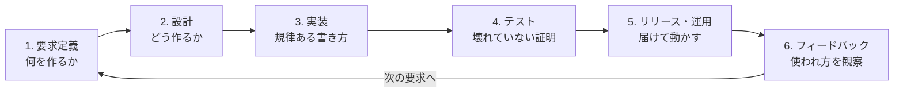
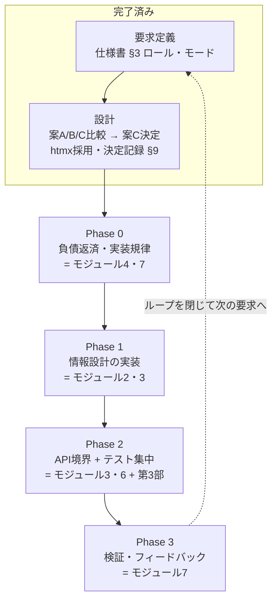
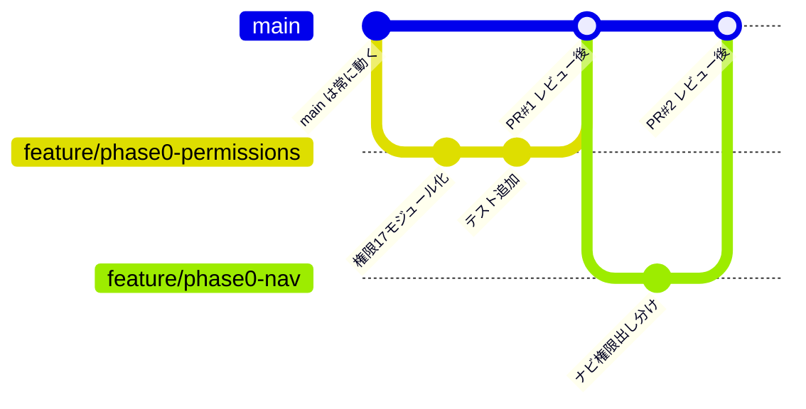
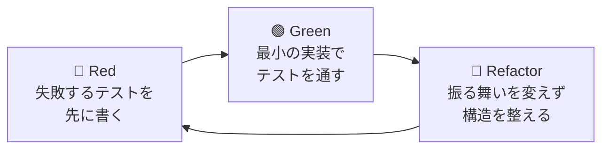

# ソフトウェア開発 学習ガイド

対象: KEM_DDENKI 開発者
構成: 序章（開発の全体像）→ 第1部 座学（体系）→ 第2部 実践（フロントエンド改修を教材に）→ 第3部 テストと品質（集中）
使い方: 序章と第1部を先に一周し、第2部は改修の各 Phase と並走、第3部は Phase 2 あたりから着手する。各モジュール末尾の「確認」に自分の言葉で答えられたら合格。答え合わせや深掘りは Claude とのチャットで行う。

---

# 序章: ソフトウェア開発の全体像 —— 一つのループ

しっかりした開発とは、突き詰めると次のループを**意識的に**回すことである。



テキスト版:

```
 ┌─→ 要求 → 設計 → 実装 → テスト → リリース → 運用 ─┐
 │                                                      │
 └────────────── フィードバック ←──────────────┘
```

各段階に対応する規律があり、KEM_DDENKI の現状と対応させると次のようになる。

## 1. 要求定義（何を作るか）

「誰が・何のために・何を必要とするか」を**作る前に**言語化する。今回のフロントエンド問題の根本原因はここにある。機能（What）は積み上がったのに、ユーザー像とユースケース（Who/Why）の整理を飛ばしたため、45リンクのナビが生まれた。フロントエンド再設計仕様書の §3（ロール表・利用モード）がまさに要求定義の実践だった。

> **教訓: コードを書く前に「誰がどう使うか」を1枚書く。**

## 2. 設計（どう作るか）

アーキテクチャの選択と**その記録**。KEM_DDENKI の ADR は既に良い実践である。「案A/B/Cの比較 → トレードオフを明示して案Cを選ぶ」という進め方が設計行為そのもの。重要なのは正解を選ぶことではなく、**選んだ理由を残すこと**（半年後の自分が「なぜ htmx なんだっけ」と迷わない）。

## 3. 実装（規律ある書き方）

小さく作って小さく統合する。具体的には: ブランチを切る → **1つの目的につき1つの PR**（巨大 PR はレビュー不能＝品質検査の放棄）→ レビュー → マージ。「Phase 0 を項目ごとに 1 PR ずつ」はこの原則の適用である。DRY（重複排除）が破られた実例が評価システム2系統だった。

## 4. テスト（壊れていないことの証明）

テストの本当の価値は「今動くこと」の確認ではなく、**将来の変更を怖くなくすること**。テストがあるから、Phase 1 でナビを大胆に再編しても「壊したら CI が教えてくれる」と安心して進める。テストピラミッド（単体テスト多め・結合テスト中くらい・E2E 少なめ）という配分の考え方も知っておく（詳細は第3部）。

## 5. リリースと運用

KEM_DDENKI の2分おき自動デプロイは諸刃の剣で、「即座に届く」利点と「壊れたコードも即座に届く」危険が同居している。だからこそ **CI green 必須・expand/contract マイグレーション**のルールが効いている。ここは既にかなり良い。

## 6. フィードバック

作って終わりにせず、使われ方を観察して次の要求に繋げる。仕様書の Phase 3（利用ログ・現場ヒアリングで検証）がこれにあたる。目安箱アプリがあるのも良い仕組みである。

## 一番効く学び方: 改修そのものを教材にする

一般論の勉強より、今回のフロントエンド改修そのものを教材にするのが最短である。Phase 0〜3 は偶然にも、要求定義（済）→ 設計（済）→ 規律ある実装 → テスト → 検証、とループを一周する構成になっている。各フェーズを進めるたびに「いま自分は開発プロセスのどの段階で、なぜこの規律を守るのか」を確認しながら進めれば、知識が体験と結びつく。



---

# 第1部 座学: 開発プロセスの体系（改修開始前に一周）

## モジュール1: 開発のループと進め方

- ソフトウェア開発は「要求 → 設計 → 実装 → テスト → リリース → 運用 → フィードバック」のループである（序章の図）
- ウォーターフォール（全工程を1回で大きく回す）とアジャイル（小さく何度も回す）の違い。個人開発 + 2分おき自動デプロイの KEM_DDENKI は事実上アジャイルであり、だからこそ1周を小さく保つ規律が生命線になる
- イテレーション（反復）の単位を意識する: 1機能 = 要求メモ → 実装 → テスト → デプロイ → 反応を見る、で1周

```
ウォーターフォール:  [====要求====][====設計====][====実装====][====テスト====][リリース]
                     （1回で大きく。後戻りが高価）

アジャイル:          [要→設→実→テ→リ] [要→設→実→テ→リ] [要→設→実→テ→リ] ...
                     （小さく何周も。1周ごとに軌道修正）
```

**確認**: 「今回のフロントエンドの問題は、ループのどの段階を飛ばしたことが原因だったか」を自分の言葉で説明できるか。

## モジュール2: 要求定義

- Who（誰が）/ Why（何のために）/ What（何を）の順で考える。What から始めると機能は増えるが使われないものができる
- ユーザーストーリー形式:「<ロール> として <目的> のために <機能> がほしい」。例:「現場担当者として、移動中に片手で日報を出したいので、スマホ最適化された入力画面がほしい」
- 非機能要件: 機能以外の要求（速度・セキュリティ・使いやすさ・保守しやすさ）。「スマホでも崩れない」は典型的な非機能要件
- スコープ管理: やらないことを決めるのも要求定義（仕様書 §10「変えないもの」がその実践）

```
考える順番:   Who（誰が） ──→ Why（何のために） ──→ What（何を）
                ↑ ここから始める                      ↑ ここから始めると
                                                        45リンクのナビが生まれる
```

**確認**: 仕様書 §3.1 のロール表を見ずに、KEM_DDENKI の6ロールと各々の主目的を言えるか。

## モジュール3: 設計の原則

- 関心の分離: 表示（テンプレート）・業務ロジック（services.py）・データ（models.py）を混ぜない。KEM_DDENKI が services 層を持つのはこの実践
- 結合度は低く、凝集度は高く: 部品同士の依存は少なく、1つの部品の中身は1つの目的に集中
- DRY（同じ知識を2箇所に書かない）/ YAGNI（今要らないものは作らない）/ KISS（単純に保つ）。評価システム2系統は DRY 違反の実例
- 設計判断は ADR に残す。正解を選ぶことより「選んだ理由と捨てた選択肢」を記録することに価値がある

```
関心の分離（KEM_DDENKI の3層）:

┌─────────────────────────────┐
│ 表示層     templates/ + htmx/Alpine     │ ← 見た目・操作だけ
├─────────────────────────────┤
│ 業務層     services.py                  │ ← 計算・判断・手続きだけ
├─────────────────────────────┤
│ データ層   models.py + Manager          │ ← 保存・取得・テナント分離だけ
└─────────────────────────────┘
  各層は下の層だけに依存する。表示層に業務ロジックを書かない。
```

**確認**: 「htmx を選んで Vue を捨てた理由」を、トレードオフの言葉（何を得て何を諦めたか）で説明できるか。

## モジュール4: 実装の規律

- ブランチ戦略: main は常に動く状態を保ち、作業は feature ブランチで行い PR で統合する
- 小さい PR の原則: 1 PR = 1目的。目安は差分 400 行以下。大きい PR はレビュー不能になり、品質検査が事実上消える
- コミットメッセージは「何をしたか」ではなく「なぜしたか」が伝わるように書く
- リファクタリング: 外から見た振る舞いを変えずに内部構造を改善すること。機能追加と同じ PR に混ぜない（レビューが濁る）



**確認**: 「Phase 0 を1つの巨大 PR でやってはいけない理由」を2つ挙げられるか。

## モジュール5: テストの考え方（概要。詳細は第3部）

- テストの価値は「今動く証明」ではなく「将来の変更を怖くなくすること」（回帰の防止網）
- テストピラミッド: 単体テスト（多・速）＞ 結合テスト（中）＞ E2E（少・遅）の配分が健全
- 何を優先的にテストするか: 壊れると被害が大きい所（金額計算・権限・テナント分離）から

**確認**: 「テストがあると Phase 1 のナビ大改編を安心して進められる」のはなぜか説明できるか。

## モジュール6: CI/CD とリリース

- CI（継続的インテグレーション）: push のたびに自動でテスト・lint を回し、壊れたら統合させない門番
- CD（継続的デリバリー/デプロイ）: 人手を介さず本番へ届ける仕組み。KEM_DDENKI の2分おき自動デプロイは CD の実践だが、「壊れたコードも2分で届く」ため CI green 必須ルールとセットで初めて成立する
- DB マイグレーションの expand/contract: 「先に追加（expand）→ 両対応期間 → 後で削除（contract）」の2段階でスキーマを変え、稼働中システムを止めない

```
expand/contract（カラム名変更の例）:

  時間 ──────────────────────────────────────→

  ① expand      ② 両対応期間          ③ contract
  新カラム追加    新旧どちらでも動く      旧カラム削除
  [old][new]     コードを先にデプロイ     [new]
                 データを移行
  ※ 一発で rename すると、デプロイの瞬間に旧コードが新スキーマを
    参照してエラー（またはその逆）になり、稼働中システムが落ちる
```

**確認**: expand/contract を使わず一発でカラム名を変更すると何が起きるか説明できるか。

## モジュール7: 運用とフィードバック

- 運用は開発の一部: ログ・監視・エラー通知がないと「壊れているのに気づかない」状態になる
- 技術的負債: 速度を優先して後回しにした品質のツケ。悪ではなく借金であり、利子（変更コスト増）を見て計画的に返す。権限マトリクスの10モジュール止まりが実例
- フィードバックループ: 利用ログ・ユーザーの声（目安箱）を次の要求定義に接続して初めてループが閉じる

**確認**: KEM_DDENKI の技術的負債を3つ挙げ、それぞれの「利子」（放置すると何のコストが増えるか）を言えるか。

---

# 第2部 実践: フロントエンド改修と並走（Phase ごと）

## Phase 0 と並走 —— テーマ「技術的負債の返済と実装規律」（モジュール4・7の実践）

実践課題:
1. Phase 0 の4項目（権限マトリクス拡張 / allowed_apps 整理 / ナビ権限出し分け / 評価統合）を、それぞれ独立した PR として計画・実施する
2. 各 PR の説明文に「なぜこの変更が必要か」「何をテストしたか」を書く
3. マージ前に自分で diff を全行読み、1件以上「もっと良くできる点」を見つけてから統合する（セルフレビューの習慣化）

**学習チェック**: PR を4つに分けたことで得られたものを実感として言えるか（レビューのしやすさ・問題発生時の切り戻し範囲・進捗の見えやすさ）。

## Phase 1 と並走 —— テーマ「要求と設計の実装」（モジュール2・3の実践）

実践課題:
1. 新ナビ実装の前に、ユーザーストーリーを5本書く（各ロール1本）。仕様書 §3.1 を story 形式に翻訳する練習
2. templates/components/ の部品を設計するとき「この部品の責務は1つか」を自問する（凝集度の体感）
3. インライン style を1画面ぶん撲滅し、before/after で「同じ変更を全画面に効かせられるか」の違いを確認する（DRY の体感）

**学習チェック**: 「関心の分離」が効いた瞬間（1箇所直したら全画面に反映された等）を具体例で言えるか。

## Phase 2 と並走 —— テーマ「境界の設計」（モジュール3・6の実践）

実践課題:
1. /api/v2/ の最初のエンドポイント（ガントのタスク配列）を作る前に、リクエスト/レスポンスの形を先に紙に書く（契約を先に決める = 契約駆動の入り口）
2. 「HTML フラグメントで返すか JSON で返すか」を画面ごとに判断し、判断基準をメモに残す（小さな ADR の練習）
3. htmx 化した画面で expand/contract 的な移行（旧画面と新画面の並走期間）を体験する

**学習チェック**: 「API は契約である」の意味を、ガント API を例に説明できるか（契約を守る限り中身を自由に変えられる）。

## Phase 3 と並走 —— テーマ「フィードバックと検証」（モジュール7の実践）

実践課題:
1. 新 UI リリース後2週間の利用ログを見て「使われていない画面」を3つ特定する
2. 現場担当者1人に画面を触ってもらい、操作に詰まった箇所を観察メモにする（ユーザビリティテストの最小形）
3. 観察結果から次の改善候補を要求定義の形（ユーザーストーリー）で書き、ループを1周閉じる

**学習チェック**: 「作った機能」と「使われた機能」のギャップを数字で言えるか。

---

# 第3部 テストと品質（Phase 2 頃から集中的に）

## 3-1. テストピラミッドを KEM_DDENKI に当てはめる

```
                    ▲
                   ╱ ╲          E2E テスト（5〜10本・遅い）
                  ╱   ╲         ブラウザ自動操作で主要動線のみ
                 ╱ E2E ╲        例: ログイン → 日報提出 → 承認
                ╱───────╲
               ╱         ╲      結合テスト（中量）
              ╱  結合テスト ╲     Django テストクライアントで view を通す
             ╱             ╲    権限・テナント分離・テンプレート描画
            ╱───────────────╲
           ╱                 ╲  単体テスト（土台・最多・速い）
          ╱     単体テスト      ╲  services.py の関数の入力→出力を検証
         ╱                     ╲ DB や画面を介さない。数百本あってよい
        ▔▔▔▔▔▔▔▔▔▔▔▔▔▔▔▔▔▔▔▔▔▔▔
```

- 単体テスト（土台・最多）: services.py の関数を対象。DB や画面を介さず、入力→出力を検証。速いので数百本あってよい
- 結合テスト（中間）: Django テストクライアントで view を呼び、権限・テナント分離・テンプレート描画まで通す。既存のテナント越境テストはここに属する
- E2E テスト（頂点・最少）: ブラウザ自動操作で主要動線のみ。遅く壊れやすいので5〜10本に絞る

## 3-2. 何をテストするか —— 優先順位の判断基準

「壊れる確率 × 壊れたときの被害」で並べる。KEM_DDENKI での優先順:

1. 金額計算（Decimal 丸め・原価集計）— 被害が金銭に直結
2. テナント分離 — 他社データ混入は信頼の致命傷
3. 権限（can_read/can_write/can_approve）— Phase 0 で拡張する部分そのもの
4. 業務ロジックの分岐（日報承認フロー・工期計算）
5. 画面の細かい見た目 — テスト対象から意図的に外す（費用対効果が低い）

## 3-3. TDD（テスト駆動開発）を1機能で体験する



体験課題: 評価者割当（EvaluatorTarget）の workers 側移植を TDD で行う。「割当のない評価者は対象者を閲覧できない」というテストを先に書き、それを通す実装を後から書く。TDD を常用する必要はないが、「テストを先に書くと設計が良くなる」感覚を一度体験しておく価値は大きい。

## 3-4. コードレビューの観点（セルフレビュー用チェックリスト）

1. 正しさ: 境界値（0件・None・権限なし・他テナント）で壊れないか
2. 安全: 生 SQL・権限チェック漏れ・秘密情報のコミットはないか
3. 明瞭: 3ヶ月後の自分が読んで意図がわかるか。名前は内容を表しているか
4. 一貫: CLAUDE.md の規律（Decimal・simple-history・services 層）に沿っているか
5. 規模: この PR は1目的か。混ざっていたら分割する

## 3-5. 品質はテストより広い（ISO 25010 のつまみ食い）

品質特性は8つあるが、社内システムでは特に次の4つを意識する。

| 品質特性 | 意味 | 担保する手段 |
|---------|------|-------------|
| 機能適合性 | 要求を満たすか | テスト |
| 使用性 | 迷わず使えるか（← 今回の改修テーマ） | ユーザー観察 |
| 保守性 | 変えやすいか（← デザインシステムの目的） | コード構造の規律 |
| 信頼性 | 落ちないか | 監視・CI/CD |

テストは主に機能適合性の道具であり、使用性はユーザー観察、保守性はコード構造の規律でしか担保できない——だから第2部の実践が必要になる。

## 3-6. カバレッジの使い方と罠

- カバレッジ（テストが通ったコードの割合）は「テストされていない場所を見つける道具」であり、目標数値にすると形骸化する
- services.py と権限まわりのカバレッジだけ意識的に高く保ち、テンプレートや管理画面は追わない
- 実行: `pytest --cov=apps --cov-report=term-missing` で「Missing 行」を眺める習慣をつける

---

# 修了の目安

- 序章・第1部: 全モジュールの「確認」に自分の言葉で答えられる
- 第2部: Phase 0〜3 の学習チェックを実体験に基づいて語れる
- 第3部: 新機能を追加するとき「どの層に・何本のテストを・なぜ書くか」を自分で決められる

学習の答え合わせ・深掘り・つまずきの相談は、この文書を参照しながら Claude とのチャットで随時行う。
