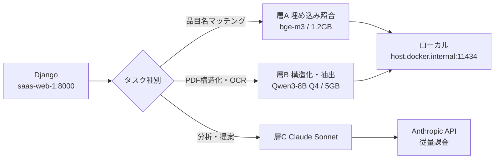

# ADR-0010: AI推論の3層分割（ローカルLLM併用）

## ステータス

**一部採用**（2026-08-20 改訂）

- 層A … 採用・実装済み
- 層B … 採用。ただし**適用先を労務単価PDFから品目名マッチングの戦略5に変更した**（下記「2026-08-20 の改訂」）
- 層C … 採用（Claude API のまま据え置き）

## コンテキスト

ADR-0006 で Claude API による分析・提案機能を導入した。その後、
`apps/estimation` に品目名マッチング（`matching.py`）と労務単価PDF構造化（`labor_pdf.py`）が加わり、
いずれも Haiku を呼んでいる。これらはループ・バッチ構造のため、稼働し始めると呼び出し回数が2〜3桁増える。

実行環境の RTX 3060 12GB は現在 GPU 使用率 0%・VRAM 617MiB（デスクトップ描画のみ）で遊休している。
ローカル推論を併用してAPI呼び出しを減らせるか検討した。

### 実測値（判断の根拠）

`ai_ailog` の集計結果。すべて Haiku。

| タスク | 入力 | 出力 | コスト | レイテンシ |
|---|---:|---:|---:|---:|
| schedule_risk | 546 | 1,527 | $0.0082 | 12.6秒 |
| schedule_suggest | 595 | 1,789 | $0.0095 | 15.5秒 |
| cost_optimization | 761 | 1,272 | $0.0071 | 12.1秒 |

1呼び出し ≒ **¥1.2**（$1=152円）。`AI_MONTHLY_BUDGET_JPY=4000` は月3,300回相当。
**本番（`saas-db-1`）の `ai_ailog` は0件**で、AI機能はまだ一度も呼ばれていない。

### 実行環境に関する前提の訂正

当初「本番は別サーバー」と想定していたが、以下により **本番・開発の2スタックとも同一PC（`DESKTOP-RMSK0VG`）が実体** と確認した。

```
hostname                  → DESKTOP-RMSK0VG
~/kem-ops/autodeploy.conf → dev  : .../KEM_DDENKI_dev  | developer | 127.0.0.1:8001
                            prod : .../KEM_DDENKI      | main      | 127.0.0.1:8000 | backup
```

この訂正により、ローカル推論は本番コストに直接効く。
一方で「同一PCの前景利用とGPUを取り合う」制約が新たに発生する。

## 決定

AI推論を3層に分け、タスク種別で振り分ける。



| 層 | 対象タスク | 実装箇所 | 実行先 |
|---|---|---|---|
| **A** | 品目名の候補絞り込み | `matching.py` `_match_by_embedding`（戦略4） | ローカル `bge-m3` |
| **B** | 絞り込んだ候補からの選択 | `matching.py` `_match_by_llm`（戦略5） | ローカル `qwen3:8b` |
| **C** | コスト最適化 / 工程提案 / 工程リスク分析 | `llm_advisor.py:279-347` | **Claude API のまま** |

1. **層Aを最優先で実装する。** 品目名の類似判定はLLM不要であり、ベクトル類似度で置き換えれば品質リスクなしに呼び出しが消える
2. **層BはQwen3-8B Q4_K_M を採用する。** 14Bではない
3. **層Cは変更しない。** 建設業の文脈判断が機能の価値そのもので、低頻度かつコスト影響も小さい
4. **ローカル失敗時はClaude APIへ自動フォールバックする。** 機能を落とすのではなくコストを払って動かす
5. **Ollamaは Windows ネイティブで動かす。** WSL内・コンテナ内には置かない

## 理由

### 層A を最優先にする理由

`matching.py:167` は `claude-haiku-4-5` に品目名マッチングを投げているが、これは埋め込み+コサイン類似度で置換できる。
**本番のAPI呼び出しが実際に減る即効施策**であり、GPU競合の影響も小さい。

ただし実測の結果、**埋め込み単体で確定判断はできない**ことが分かった（下記「導入後の実測」を参照）。
候補生成に使い、確定は閾値とLLMフォールバックの組み合わせで行う。

### 8B を選ぶ理由

VRAM 12,288MiB のうち617MiBはデスクトップ描画が使用中。実効約11GB。

| 構成 | モデル | KVキャッシュ | 空き |
|---|---:|---:|---:|
| Qwen3-8B Q4 + 埋め込み | 5.1GB | 1.8GB | 約4.1GB |
| Qwen3-14B Q4 | 9.2GB | 1.8GB | 約0.6GB |

`labor_pdf` は `raw_text[:3000]` + テーブルJSON を入力し `max_tokens=4000` を出力するため、
コンテキスト用の余白が要る。また速度差が実時間に効く。

- 8B: 45〜55 tok/s → 50ページPDF 約1時間
- 14B: 28〜33 tok/s → 50ページPDF 約1.8時間

20B級（gpt-oss-20b等）はコンテキストを伸ばすと確実に溢れるため対象外。

### 層C を据え置く理由

**電力コストで負けるからではない。** 理由は品質とレイテンシの2点。

1. **品質** — 建設業の文脈判断そのものが機能の価値。8Bに落とすと提案内容の質が下がり、機能を作った意味が薄れる
2. **レイテンシ** — 13秒 → 33秒。これらは画面から同期的に呼ばれるUI機能で、2.5倍の待ち時間はそのままUXの劣化になる

逆に層Bは非同期バッチのため、1時間かかっても実害がない。
**「安いから移す」ではなく「遅くても困らないから移す」** という切り分けである。

### 損益分岐

前提: 31円/kWh、GPUアイドル増分8W（月180円）、推論時140W。

1回あたりの実費（分析系相当・出力1,500トークン）:

```
Qwen3-8B  50 tok/s → 生成 30秒
30秒 × 140W = 4,200 J = 0.00117 kWh × 31円/kWh = 0.036円
```

| | Claude API 分析系 | Claude API 抽出系 | ローカル 8B |
|---|---:|---:|---:|
| 1回の費用 | ¥1.22 | ¥0.18 | **¥0.04** |
| 所要時間 | 13秒 | — | 33秒 |

常駐する場合の分岐点は以下。`keep_alive` を0にすれば固定費が消え、**分岐点そのものがなくなる**。

| 対象 | API単価 | 常駐時の分岐点 |
|---|---:|---:|
| 分析系 | ¥1.22/回 | 月150回 |
| 抽出系 | ¥0.18/回 | 月1,000回 |

### `keep_alive` はリクエスト単位で使い分ける

環境変数で一律 `OLLAMA_KEEP_ALIVE=0` にするのは最適ではない。
都度アンロードは毎回3〜5秒のロード時間を伴い、
**50ページのPDFバッチで毎回解放すると約3分がロードだけで消える**。

```python
# 単発呼び出し — 終わったら即解放（固定費ゼロ）
{"model": "qwen3:8b", "keep_alive": 0, ...}

# バッチ処理中 — 保持したまま連続実行
{"model": "qwen3:8b", "keep_alive": "10m", ...}
```

バッチが1時間走る間の保持電力は 8W × 1h ≒ 0.25円。ロード時間3分と引き換えなら十分に安い。

### この設計で本当に得られるもの

削減額そのものは大きくない。

| 月間呼び出し | API | ローカル | 差額 |
|---:|---:|---:|---:|
| 300回（分析系） | ¥366 | ¥12 | ¥354/月 |
| 3,000回（抽出系） | ¥540 | ¥120 | ¥420/月 |

年間5,000円前後で、`AI_MONTHLY_BUDGET_JPY=4000` の上限が効くため青天井にもならない。
費用削減だけを目的にするなら投資対効果は薄い。実際の価値は次の2点にある。

1. **予算上限でAI機能が止まらなくなる。** 現在 `check_budget_and_notify()` は上限到達時に
   AI機能を丸ごと停止する（`llm_advisor.py:161-169`）。層A・層Bをローカルへ逃がせば、
   上限に当たるのは層Cだけになり、業務が止まる範囲が狭まる
2. **`bulk_match` を気兼ねなく回せる。** 従量課金では数千件の一括マッチングを躊躇するが、
   電気代なら実行を我慢する理由がなくなる

**機能は一つも削らない。品質が価値の中核でないタスクだけ実行先を変える。**
コスト最適化はその結果であって、目的ではない。

## 導入後の実測（2026-08-14）

Ollama 0.32.9 / `qwen3:8b`（Q4_K_M 5.2GB）/ `bge-m3`（1.2GB）を導入し、実測した。
詳細は [`docs/saas/design/local-inference-runbook.html`](../design/local-inference-runbook.html)。

| 項目 | ADRの想定 | 実測 |
|---|---|---|
| 生成速度 | 45〜55 tok/s | **58 tok/s** |
| VRAM（8B単体） | 5.1GB | **5,994 MiB** |
| VRAM（8B + 埋め込み） | 約6.9GB | **6,745 MiB** |
| 推論時消費電力 | 140W | **155W** / 74℃ |
| コールドロード | 3〜5秒 | **3.3秒**（ウォーム 0.21秒） |
| 埋め込みレイテンシ | 数十ms | **約220ms**（初回 2,646ms） |

速度・VRAMは想定通りかそれ以上。1回0.04円の費用試算は誤差の範囲で変わらない。
埋め込みレイテンシの想定は楽観的だったため、一括埋め込みAPI（`input` に配列）でまとめる。

### 埋め込み単体では確定判断できない

「VVFケーブル 1.6mm 2芯 100m巻」を基準にコサイン類似度を実測した。

| 対象 | 類似度 | 関係 |
|---|---:|---|
| VVFケーブル1.6-2C 100m巻き | 0.904 | 同一品目・表記ゆれ |
| VVF 1.6×2C 100m | 0.768 | 同一品目・略記 |
| CVケーブル 2.0mm 3芯 | 0.668 | **別種ケーブル** |
| エアコン用コンセント 250V 20A | 0.443 | 無関係 |
| 分電盤 20回路 | 0.343 | 無関係 |

**同一品目の略記（0.768）と別種ケーブル（0.668）の差が0.10しかない。**
単一閾値で自動確定させるとCVケーブルをVVFとして誤マッチする。したがって層Aは次の3段構えとする。

- 0.85以上 … 自動確定
- 0.65〜0.85 … 上位k件を `_match_by_llm` に渡して選ばせる
- 0.65未満 … 不一致

### 構造化は JSON Schema を渡す

`format` に文字列 `"json"` を指定するだけでは、キー名も構造も守られない出力になった。
**JSON Schema オブジェクトそのものを渡す**と構造・キー名・型がすべて守られ、
副次的に出力トークンが 1,550 → 111、所要が 27秒 → 2秒に減る。

`think` の有無で抽出精度は変わらなかった（いずれも正答 3/3）ため、
構造化タスクでは `think: false` とする。

## 2026-08-20 の改訂 — 層Bの適用先を変更する

層Bを実装しようとして、ADR執筆時の前提が3つ崩れていることが分かった。

### 1. 労務単価PDFはLLMを必要としなくなった

コミット `aaf8f11` で `labor_table.py`（決定論的パーサ）を新設した結果、実データ
（令和8年3月適用の公共工事設計労務単価表 p.3、正解422件）の成績はこうなった。

| | 抽出 | 適合率 | 再現率 | 時間 | 費用 |
|---|---:|---:|---:|---:|---:|
| 決定論的パーサ | 422件 | **1.000** | **1.000** | 0.0秒 | 0円 |
| ローカル Qwen3-8B | 373件 | 0.678 | 0.600 | 315秒 | 0円 |
| Claude Haiku | 0件 | 0.000 | 0.000 | 18秒 | 3.7円 |

`structure_all_pages()` は `looks_like_rate_table()` が真ならLLMを通さない。
**LLM経路は「表が崩れたページの保険」に格下げ済み**で、実行頻度がほぼゼロになった。
ここをローカル化しても削減額は生まれず、しかもローカルは F1 0.64 なので
保険としても頼りない。**層Bの適用先として不適格である。**

### 2. 取引先抽出は画像入力なのでテキストモデルに載らない

ADRが層Bに挙げた「納品書OCR / 取引先抽出」の実体は `apps/masters/extractor.py` で、
`_encode_image()` で画像をbase64送信するマルチモーダル呼び出しである。
**`qwen3:8b` は vision を持たない。** 移すには `qwen2.5-vl` 等のVLM導入という
別の意思決定が要るため、本ADRの範囲外とする。

### 3. ADR執筆後に層C相当の呼び出しが増えた

`apps/bids/announcement_llm.py`（ADR-0012）が追加された。入札公告PDFの構造化で、
一見すると層B（抽出系）だが `MODEL_KEY = "sonnet"` を意図的に選んでいる
——「参加要件の読み違いは入札可否の判断を誤らせる」ため。
**判断に直結する抽出は層Cとして扱う。**

### 決定 — 層Bの最初の適用先は `_match_by_llm`（戦略5）とする

労務単価PDFの代わりに、**品目名マッチングの戦略5**をローカルに振る。

| 判定軸 | 労務単価PDF | 戦略5（採用） |
|---|---|---|
| 入力 | 自由記述の表テキスト | テキストのみ |
| 出力 | 数百件の自由記述抽出 | **有限個の候補コードから1つ選ぶ** |
| 決定論的に解けるか | **解ける**（F1 1.000） | 解けない（表記ゆれの意味判断） |
| 実行頻度 | ほぼゼロ | **`bulk_match` で数千件** |
| 品質が価値の中核か | — | いいえ（confidence 30〜60 で必ず人間が承認する） |

決め手は**出力が有限集合であること**。候補コードをそのまま JSON Schema の
`enum` に埋め込めるので、存在しないコードを生成する余地が構造的に無くなる。
自由記述の抽出（ローカル F1 0.64）とは難易度が違う。

さらに戦略4（埋め込み）が候補を上位5件に絞った後に呼ばれるため、
入力が小さくコンテキストにも余裕がある。ADRが挙げた
「`bulk_match` を気兼ねなく回せる」という価値にも直接効く。

### 戦略5の実測（2026-08-20 / qwen3:8b）

実機（RTX 3060 12GB）で `/api/chat` に上記スキーマを渡して測った。
候補4件・「VVF 1.6×2C 100m」を「VVFケーブル 1.6mm 2芯 100m巻」に照合させるケース。

| | 出力トークン | 1件あたり | 選んだコード |
|---|---:|---:|---|
| `reason` あり | 303 | 5.44秒 | A-001（正解） |
| **`reason` なし** | **62** | **1.39秒** | A-001（正解） |

`reason` はプロンプトが要求しているが、**本文はどこでも読んでいない**。
日本語の説明文が出力の大半を占めていたため、ローカル側のスキーマから外した。
モデルは書かなくなり、選ぶコードは変わらないまま**約3.9倍**速くなる。
`bulk_match` が数千件を回すことを考えると、この差はそのまま実時間に効く。

`temperature: 0` で3回とも出力トークン数まで完全に一致した。再現性は問題ない。
コールドロードは 17.6秒、ウォームの `load_duration` は 0.19秒
（`keep_alive` がホストの `OLLAMA_KEEP_ALIVE=0` を上書きできている）。

### 戦略5の正答率（2026-08-20 / qwen3:8b）

本番・開発とも `EstimationItem` 0件・`ItemAlias` 0件で、承認済みエイリアスを
正解データにできなかった。実データを待つと測定が無期限に止まるため、
電材の表記ゆれのゴールデンセットを作って測った
（`tests/fixtures/item_matching_pairs.json`、24ケース / 候補プール20件）。

| | 正答 | 正答率 | 所要 | 1件あたり |
|---|---:|---:|---:|---:|
| ローカル qwen3:8b | **24/24** | **1.000** | 81.6秒 | 3.40秒 |

**実運用より難しい条件で測っている。** 本番では戦略4が候補を5件に絞ってから
戦略5が呼ばれるが、この測定では20件すべてを候補として渡している
（1件あたりの所要が先の実測 1.39秒 から 3.40秒 に伸びているのはそのため）。

ゴールデンセットには単純な文字列一致では解けないケースを入れてある。
`ELB 3P30A 30mA` → `漏電ブレーカ 3P30A 30mA`、`MCCB 2P20A` → `配線用遮断器 2P20A`
は「ELB=漏電ブレーカ」「MCCB=配線用遮断器」という電材の知識が要る。
ほかに 心/芯、sq/㎟、Φ/φ、BOX/ボックス、かな交ぜ書き（しゃ断器）、
語順違い、空白なしを含む。

**限界:** これは合成データであり、実際の発注データの汚さは反映していない。
Claude との比較ベースラインも未測定のため、「ローカルが優秀」なのか
「このセットが易しい」のかは切り分けられていない。

**測り直しは自動化してある。** 人が覚えていることに依存させない。
`scripts/scheduler.sh` が **毎週日曜 03:00 以降**に
`verify_item_matching --min-accuracy 0.8` を回す。

- 正解データは承認済み `ItemAlias`。**承認済みが1件も無ければ何もせず終了コード0**。
  見積アプリを使い始めるまでは無害な空振りになる
- 承認が貯まった時点で自動的に実データでの測定に切り替わる
- 正答率が 0.8 を割ったら終了コード1になり、cron のログに失敗として残る
- ローカル推論のみで API は叩かないため課金は発生しない（電気代のみ）
- 夜間に寄せているのは GPU の前景利用と取り合わないため

### 層Bの一般則（今後の適用先の判定基準）

1. **決定論的に解けるなら、そちらを先に尽くす。** LLMは最後の手段
2. **テキスト入力に限る。** 画像・PDFブロックはVLMが要る
3. **出力が有限集合に拘束できるほど、小さいモデルで成立する**
4. **判断に直結する抽出は層Cに置く。** 「抽出系だから安いモデル」ではない
5. **精度を測る手段が無いタスクは移さない。** 労務単価PDFのF1が0だったことに
   長期間気づけなかったのは、測っていなかったからである

## 影響

### コード変更

層A（実装済み）:

- `apps/estimation/services/embedding.py` … Ollama `/api/embed` クライアント
- `apps/estimation/services/matching.py`
  - `_match_by_embedding()` を新設し、`_match_by_spec` の後・`_match_by_llm` の前に挿入
  - `EstimationItem` にベクトル列を追加（現行の件数規模では pgvector 不要、numpy で足りる）

層B（実装済み）:

- `apps/ai/services/local_llm.py` … **新設。** Ollama `/api/chat` クライアント。
  JSON Schema を必須にし、到達不可・スキーマ違反・JSON崩れのいずれも
  例外を投げず None を返す。依存追加はせず stdlib の urllib で足りる
- `apps/ai/services/llm_advisor.py`
  - `MODEL_CONFIG` に `"local"` キーを追加。`display` は既存の `AILog.ModelType.CUSTOM`
  - `_dispatch_call()` を新設。`_call_claude()` は Anthropic 専用のまま残す
  - `_local_is_eligible()` でマルチモーダル入力とSchema無しを弾き、静かにAPIへ戻す
  - `_calculate_cost()` は `"local"` の単価が全て0なので自動的に0を返す
  - **AILog には要求ではなく実績（`used_model_key`）を記録する。**
    ローカルを頼んでAPIに落ちた回を local として記録すると cost_usd が0で埋まり、
    費用の出所が追えなくなる
  - **ローカル経路は月間予算チェックを通さない。** 従量課金ではないので
    上限で止める理由が無く、通してしまうと本ADRの主目的が崩れる
- `apps/estimation/services/matching.py`
  - `_match_by_llm()` を `_ask_local()` → `_ask_claude()` のフォールバック構成に分離
  - `_build_match_schema()` で候補コードを `enum` に埋め込む
  - `LOCAL_MAX_CANDIDATES = 20`。戦略4が絞れず「先頭100件」に落ちたときは
    ctx=8192 に収まらないのでローカルを使わない
- `config/settings.py` … `OLLAMA_CHAT_MODEL` / `_TIMEOUT` / `_ENABLED` / `_NUM_CTX` を追加。
  **`OLLAMA_CHAT_ENABLED` の既定は `False`。** タスクごとに精度を実測してから有効化する
- `apps/ai/models.py` は変更不要（`ModelType.CUSTOM` が既に定義済み）。**マイグレーション無し**
- `tests/test_ai_local_inference.py` … 新設。実通信はせず urlopen をモックする

### 運用

- Ollama を Windows ネイティブで導入。コンテナからは `host.docker.internal:11434`
- `OLLAMA_NUM_THREAD=4`（6コアのうち2つを Django/Postgres に残す）
- `keep_alive` は環境変数で固定せず、**リクエスト単位で指定する**（単発は `0`、バッチ中は `"10m"`）
- バッチは既存の 12:30 自動バックアップと同様、夜間スケジュールに寄せる
- **GPUは電力制限をかけず定格で運用する。** ファン音は許容できるとの判断。
  LLM推論はメモリ帯域律速で実消費は140W前後に収まり、上限を絞っても
  費用はほとんど変わらない一方、速度は約10%落ちるため

### リスク

| リスク | 対処 |
|---|---|
| VRAM競合でロード失敗 | API自動フォールバック + `KEEP_ALIVE=0` |
| 連続推論時の発熱（アイドル56℃→70〜80℃） | 定格運用で許容する。ファン音は問題にならないため電力制限はかけない |
| ローカル出力のJSON崩れ | `_parse_json_response()` 失敗時にAPIへ再試行。導入前にClaude出力と突き合わせ検証 |
| このPC停止で本番停止 | 新規リスクではない（既に本番がこのPCで稼働） |

## 導入順序

1. ~~層A（埋め込みマッチング）~~ — 完了（2026-08-14）
2. ~~Ollama + Qwen3-8B を導入し、`labor_pdf` の構造化で精度検証~~ — 完了。
   その結果、決定論的パーサに置き換えて層Bの適用先を変更した（上記改訂）
3. ~~`llm_advisor.py` にプロバイダ抽象とAPIフォールバックを実装~~ — 完了（2026-08-20）
4. ~~戦略5の精度を実測する~~ — 完了（ゴールデンセットで 24/24）。
   実データが無いため合成データでの測定にとどまる
5. **`OLLAMA_CHAT_ENABLED=True` にして本番投入する** ← 次。
   実データが貯まったら承認済みエイリアスで測り直す
6. 層Cは据え置き

## 補足資料

図と損益分岐シミュレータ付きの解説: [`docs/saas/design/ai-inference-tiering.html`](../design/ai-inference-tiering.html)

関連: ADR-0006（Claude API統合）, ADR-0008（見積アプリ）
